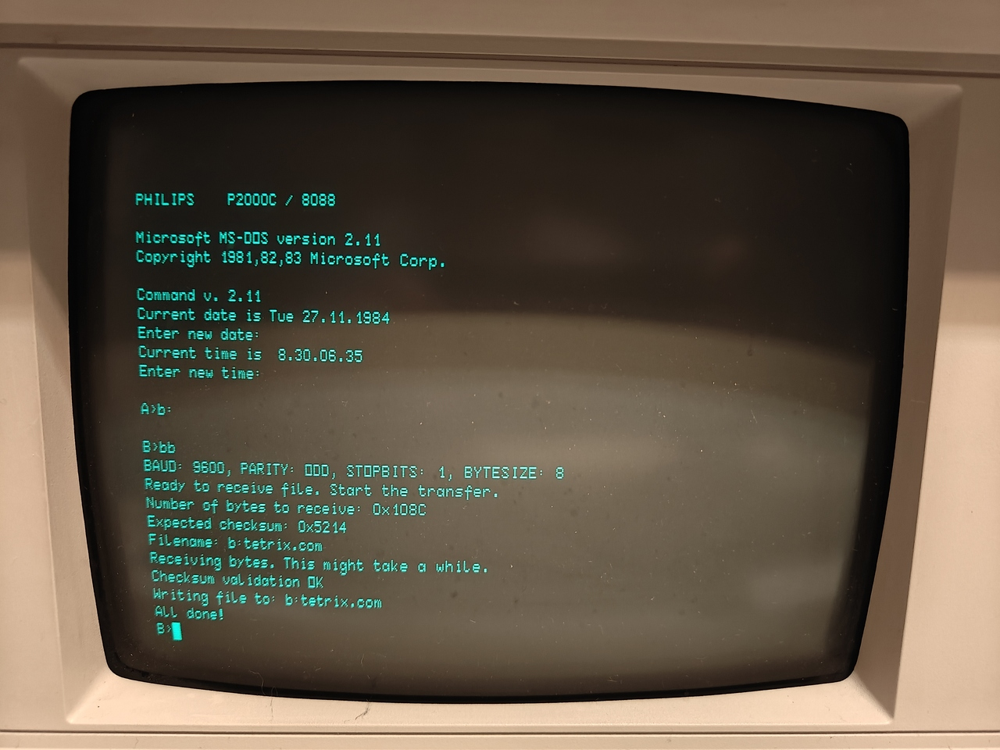

# P2000C ByteBridge (BB) Serial File Transfer

## Purpose
This repository allows files to be transmitted from a modern machine to the
P2000C using its serial interface port. On the transmitter device, a Python
script is executed which informs the P2000C on the file size, its name and a
CRC16 checksum. After the P2000C is able to successfully relay this data back to
the transmitter device, file transfer is conducted. If the CRC16 checksum is
reproduced on the P2000C, the file will be written to the floppy drive.



## Usage

Open the file `upload.py` and specify the `srcfile` and `dstfile` variables. For
example, to upload the local `bb.com` compilation to the P2000C and store it
on the B drive, we use

```python
upload('../src/bb.com', 'b:bb.com')
```

On the P2000C, run `BB.COM` and wait until the message

```
Ready to receive file. Start the transfer.
```

is seen. **Do not execute the Python script before this message is seen.**
Premature execution of the Python script potentially results in the P2000C
locking up, requiring the machine to reboot.

Once the above message is seen on the P2000C, execute the script.

## Compilation instructions

`BB.COM` can be compiled using [NASM](https://www.nasm.us/). For convenience,
a `Makefile` is provided to assist in the compilation.

```bash
cd src
make
```

## Initial transfer

Of course, to get `BB.COM` onto your P2000C, one would need to have some kind of
transfer program, yet this is exactly the function that `BB.COM` is fulfilling.
As such, we here provide a brief tutorial how to initially get `BB.COM` onto
your machine.

1. Boot in the MS-DOS environment in your P2000T.
2. Open `DEBUG.COM`
3. Type `A 100` to start the inline assembly procedure at memory address `$100`.
   Copy the following instructions into the machine. For convenience, in the
   code listing below, also comments are added to explain what the code is
   doing. You do not have to copy these comments into your P2000C. Once you have
   copied the listing below, simply hit <ENTER> twice to exit the
   inline-assembly mode.

```
MOV AH,2
INT 14          ; retrieve lower byte from serial port
MOV CL,AL       ; store in CL
MOV AH,2        
INT 14          ; retrieve upper byte from serial port
MOV CH,AL       ; store in CH
MOV DI,200      ; set pointer to memory address $200
MOV AH,2
INT 14
MOV [DI],AL
INC DI
LOOP 10F        ; keep on looping until all bytes are received
INT 20
```

4. Verify that you have correctly typed in the code by deassembling using
   `U 100 118`. You should see a listing such as shown below.

```
0A4C:0100 B402          MOV     AH,02
0A4C:0102 CD14          INT     14
0A4C:0104 88C1          MOV     CL,AL
0A4C:0106 B402          MOV     AH,2
0A4C:0108 CD14          INT     14
0A4C:010A 88C5          MOV     CH,AL
0A4C:010C BF00002       MOV     DI,0200
0A4C:010F B402          MOV     AH,02
0A4C:0111 CD14          INT     14
0A4C:0113 8805          MOV     [DI],AL
0A4C:0115 47            INC     DI
0A4C:0116 E2F7          LOOP    10F
0A4C:0118 CD20          INT     20
```

5. At this point, the program resides in memory and you can run it. Before
   running this script, it is important to understand that the `INT 14,2`
   command has a 20 second timeout. If no byte is retrieved in this time span,
   the program will time out, potentially leading to undesired behavior. As
   such, make sure that after you have run the program, you also execute the
   Python code `bootstrap.py` on your modern machine. To run the program,
   execute `G 100`. Once the program completes, you will return to the debug
   program, but with `BB.COM` stored in memory starting at `$200`.
6. Let us test that the transfer was successful by deassembling the memory
   starting at $200. `U 200 220`. The result should correspond to the assembly
   as found in [the source file](src/bb.asm).
7. If successful, you are now in the position to save the program to the floppy
   disk. For this, you need to know the size of the program, which is part of
   the output of the `bootstrap.py` program. First, specify the number of bytes
   by typing `R CX`. Specify the length of the program, in bytes, in hexadecimal
   notation to your machine. Next, type `n b:bb.com` to store the program as a
   new file, on drive B, named as `BB.COM`. Finally, start the write process
   by `w 200`, which will write the number of bytes stored in `CX` starting at
   memory location `$200` to the file specified via the `n` command.
8. The program is now stored on disk and you can test it.